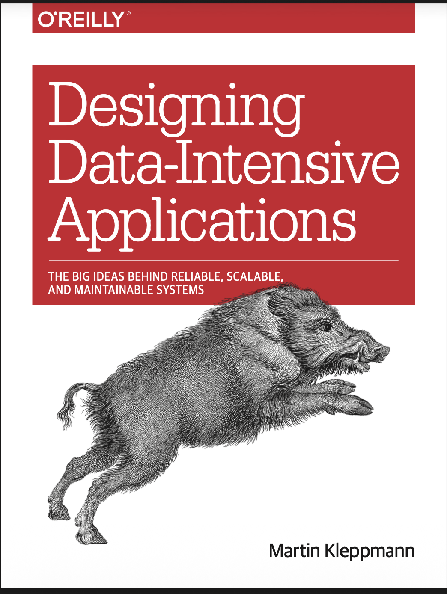

# Designing Data Intensive Applications

## Preface

We call an application data-intensive if data is its primary challenge—the quantity of data, the complexity of data, or the speed at which it is changing—as opposed to compute-intensive, where CPU cycles are the bottleneck.

The goal of this book is to help you navigate the diverse and fast-changing landscape
of technologies for processing and storing data. This book is not a tutorial for one
particular tool, nor is it a textbook full of dry theory. Instead, we will look at examples
of successful data systems: technologies that form the foundation of many popular
applications and that have to meet scalability, performance, and reliability require‐
ments in production every day.

After reading this book, you will be in a great position to decide which kind of tech‐
nology is appropriate for which purpose, and understand how tools can be combined
to form the foundation of a good application architecture.

## Who Should Read This Book?

This book is for software engineers, software architects, and technical managers who
love to code. It is especially relevant if you need to make decisions about the architec‐
ture of the systems you work on—for example, if you need to choose tools for solving
a given problem and figure out how best to apply them. But even if you have no
choice over your tools, this book will help you better understand their strengths and
weaknesses.

## Acknowledgments

In computing we tend to be attracted to things that are new and
shiny, but I think we have a huge amount to learn from things that have been done before.