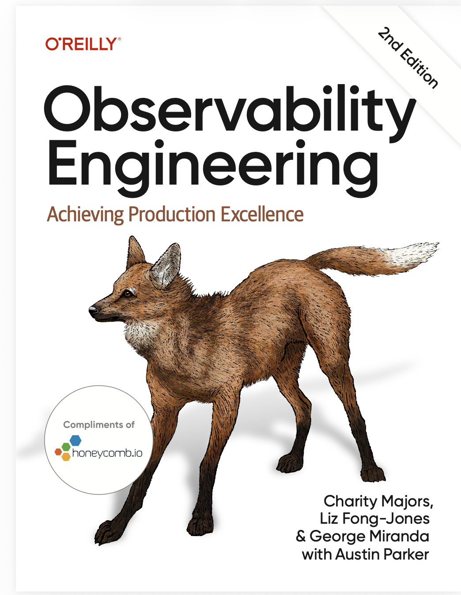

# Observability Engineering

This is a book for builders and technical decision-makers. Ten new
chapters for staff+ engineers, architects, and technical leaders cover
the strategic and organizational side. Four more chapters tackle
LLMs and AI agents, frontend observability, and open source tooling.

- Learn how to develop with observability, whether you’re using AI or not
- Implement modern observability practices across your organization
- Make the business case and navigate build versus buy decisions
- Maximize the cost-effectiveness of your observability tooling
- Find answers fast when reliability is on the line