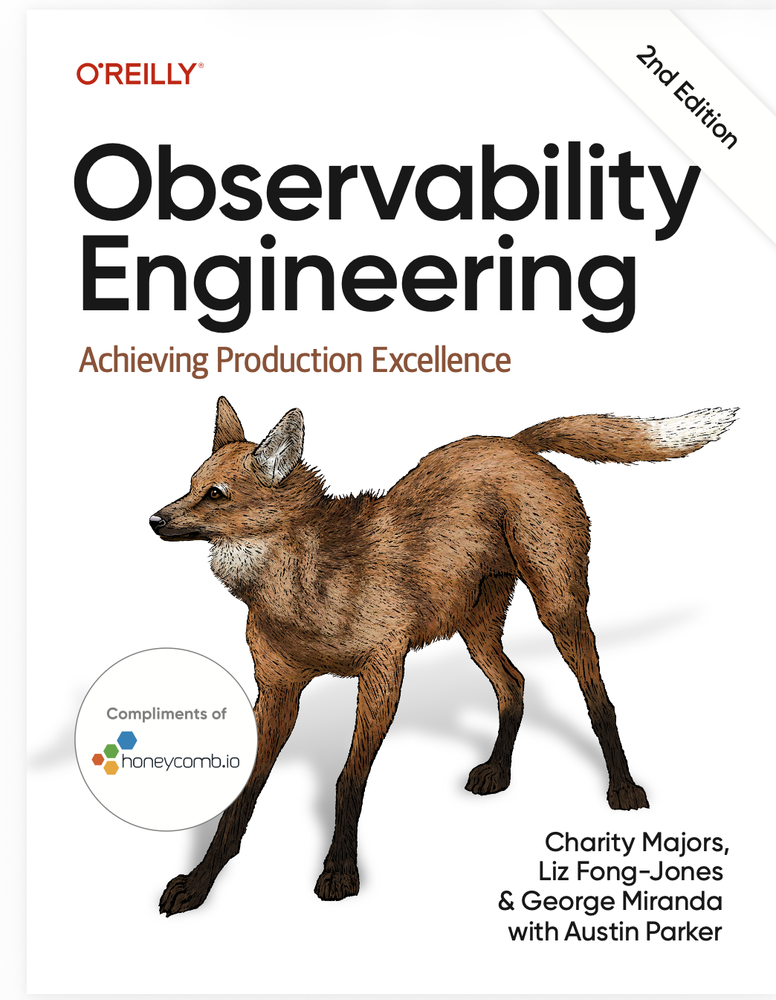

# Observability Engineering

This is a book for builders and technical decision-makers. Ten new
chapters for staff+ engineers, architects, and technical leaders cover
the strategic and organizational side. Four more chapters tackle
LLMs and AI agents, frontend observability, and open source tooling.

- Learn how to develop with observability, whether you’re using AI or not
- Implement modern observability practices across your organization
- Make the business case and navigate build versus buy decisions
- Maximize the cost-effectiveness of your observability tooling
- Find answers fast when reliability is on the line

## How to Read This Book

- Part I is for all readers
- Parts II and III are written primarily for software engineers and observability practitioners. Every software engineer should understand how to instrument their code and use the telemetry it emits
- Part IV is for engineers who want to go beyond the surface.
- Part V covers a number of different use cases for observability.
- Part VI is for technical decision-makers